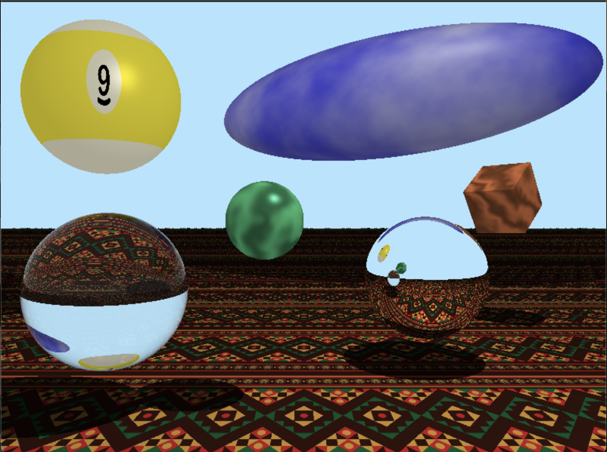

# Ray Tracing Project

**Authors:** Abid Jeem

## Overview

This repository contains a basic **ray tracer** in Python. It supports:

- **Spheres, Planes, Cubes, Ellipsoids, Torus**  
- **Recursive Ray Tracing** (reflections and refractions)  
- **3D Noise Materials** (clouds, wood, marble, etc.)  
- **2D Image Texturing** for spheres and planes  
- **Sky Plane** or background with a texture  
- **Fog/Atmospheric** effects

---

## Features

1. **Recursive Reflection & Refraction**
   - Objects can have a `reflection_factor` (0.0 to 1.0).
   - Transparency (trans) and refraction index for glass/water-like materials.
   - Fresnel approximations, partial reflection/refraction.

2. **Multiple Lights**
   - Directional or Point Lights
   - Basic shadow checks (hard shadows).

3. **Progressive Rendering**
   - Renders from coarse to fine resolution.
   - Cancel early by closing the PyGame window.

4. **Modular Objects & Materials**
   - **Objects** each implement `intersect(...)` and `getNormal(...)`.
   - **Materials** can be plain color, 3D noise, or 2D textures.

